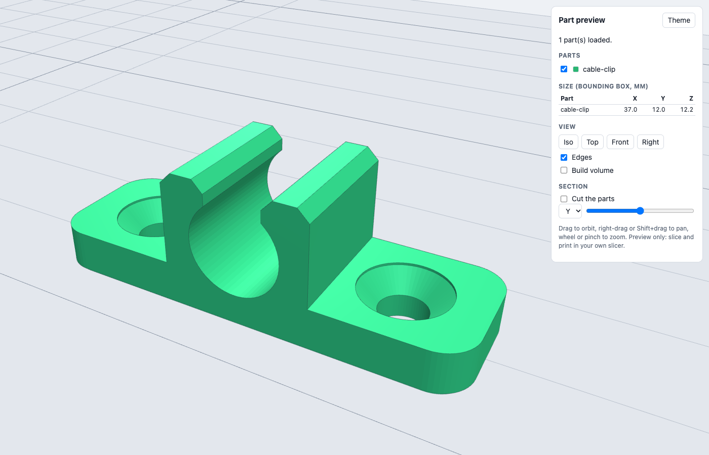
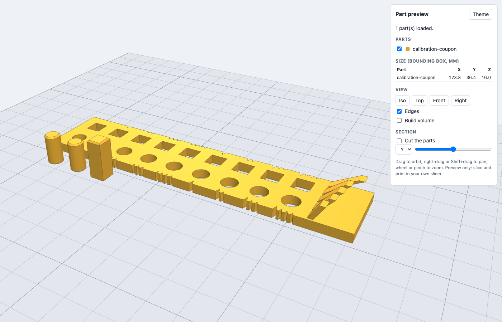

# 3d-print-design

A Claude Code skill that designs parts for FDM 3D printing in code: from a
verbal idea to a checked STL with a browser preview, for any printer. It
interviews you, writes a parametric build script, refuses to export a part
that fails its printability checks, shows the result in a local 3D viewer and
hands you the STL with a short print sheet.

**It never talks to your printer.** No G-code, no network calls to printers,
no starting prints. You slice and print with your own slicer.



*The fictional example cable clip in the local viewer (headless Chrome render).*

## What it does

1. **Intake**: a short interview (see below), then a one-paragraph summary to confirm.
2. **Sketch**: the part in words plus a dimension table (measured / derived / default, critical or not).
3. **Reuse**: starts from an example or the template's default part when one is close.
4. **Parametric script**: `templates/build.py` copied into your project. Every number lives in one commented parameter block (millimetres, with the reason for each value).
5. **printcheck before export**: watertight and consistent winding, positive volume, body count, sits on the bed with real contact area, fits the build volume with a margin, overhang report (bridges counted separately), layer alignment, small and horizontal holes, optional thin-wall sampling, and probe points that catch a mirrored (wrong-hand) part. Errors block the STL.
6. **Preview**: `scripts/serve.py` serves the output folder on 127.0.0.1 to a three.js viewer: per-part colours, orbit, bed grid of your printer's size, section plane, bounding box readout in mm, dark and light.
7. **Iterate on numbers**, not on prints.
8. **Calibration coupon** for fits: holes and pegs at 0.00 to 0.40 mm per side, read by counting notches, recorded into `fits.json` that the build scripts use.
9. **Delivery**: STL(s), metadata JSON (bounding box, volume, mass upper bound, triangle count, check results, parameters), preview, print sheet.

## The intake questions

Asked in your language, at most two short rounds, skipping anything you already said:

- What does the part do and where does it live?
- Critical dimensions measured with calipers, and which are critical?
- Mating parts and fit type: press, snug, sliding or free?
- Load, heat, outdoor or UV exposure?
- Printer model, build volume, nozzle diameter?
- Material: PLA, PETG, TPU (ABS or ASA only with ventilation)?
- Colours: single, colour change at a layer, or multi-material?
- Quantity, looks vs strength, supports allowed, orientation constraints, deadline?
- If it reproduces a real person's face or likeness: that person's consent first.

Defaults when skipped are in [references/intake.md](references/intake.md).

## Install

```
git clone https://github.com/Matteoikarieth96/3d-print-design-skill ~/.claude/skills/3d-print-design
cd ~/.claude/skills/3d-print-design
python3 -m venv .venv && .venv/bin/pip install -r requirements.txt
```

Requirements: Python 3.11 or newer for the geometry stack (pinned in
`requirements.txt`: numpy, trimesh, manifold3d, shapely; no scipy, networkx or
rtree needed). The server, the SVG renderer and the PNG renderer use only the
standard library. A browser for the preview; Google Chrome or Chromium only if
you want PNG renders.

## Usage

Ask Claude in your own words, for example "design a clip to hold a 7 mm cable
bundle under my desk" or "disegnami un supporto per il router da avvitare al
muro". The skill takes it from there.

Manual use, from a project folder:

```
cp ~/.claude/skills/3d-print-design/templates/build.py .
~/.claude/skills/3d-print-design/.venv/bin/python build.py            # check + write out/<name>.stl
~/.claude/skills/3d-print-design/.venv/bin/python build.py --check    # check only
python3 ~/.claude/skills/3d-print-design/scripts/serve.py out --open  # preview
python3 ~/.claude/skills/3d-print-design/scripts/render_png.py out --out out/preview.png
~/.claude/skills/3d-print-design/.venv/bin/python ~/.claude/skills/3d-print-design/scripts/printcheck.py part.stl --bed 220x220x250 --layer 0.2 --overhang 45
```

Calibration coupon:

```
~/.claude/skills/3d-print-design/.venv/bin/python ~/.claude/skills/3d-print-design/scripts/calibration_coupon.py build --out out
# print it, test the pegs, then:
~/.claude/skills/3d-print-design/.venv/bin/python ~/.claude/skills/3d-print-design/scripts/calibration_coupon.py record --press 0.10 --snug 0.15 --sliding 0.20 --free 0.30 --overhang 45 --material PETG
```



## Outputs

| File | Content |
|---|---|
| `out/<name>.stl` | binary STL in millimetres, Z up, sitting on z = 0 in print orientation |
| `out/<name>.json` | bounding box, volume, solid mass upper bound, triangle count, full printcheck result, parameter snapshot, STL sha256 |
| `out/manifest.json` | written by `serve.py`: parts, colours, bed size for the viewer |
| `fits.json` | your measured clearances (from the coupon) |

## What it does NOT do

- No printer control of any kind: no G-code, no calls to printer hosts or cloud print services, no starting prints.
- No slicing. Supports, seams, infill and speeds are set in your slicer.
- No structural analysis (no FEA). Load advice is rules of thumb.
- No font rendering: marks are notches and symbols; add text in the slicer if needed.
- Not for safety-critical parts (see [references/safety.md](references/safety.md)).

## Examples (fictional)

- [examples/cable-clip](examples/cable-clip): desk-edge cable clip with countersunk screw holes and a snap-in channel.
- [examples/calibration-coupon](examples/calibration-coupon): the tolerance and overhang coupon.

## Security summary

Local only. The preview server binds 127.0.0.1, serves one folder, refuses
`..`, subfolders, symlinks and non-allowed file types, checks the Host header
and sends a strict Content-Security-Policy. Part names and output folders are
validated. STL files are parsed as numbers only. three.js r128 is the only
external script, loaded from cdnjs with an integrity hash; the STL parser and
orbit control are small built-ins, so nothing else is fetched or vendored.
Details: [SECURITY.md](SECURITY.md).

## Limitations

- printcheck is a set of heuristics, not a slicer: thin-wall sampling is
  random-ray based, holes are found on 15 sections, bridges are detected by a
  rule (held on most of the outline and at most 10 mm wide).
- The viewer needs three.js from cdnjs; offline it shows flat SVG pictures instead.
- Headless WebGL renders depend on the local Chrome; `render_png.py` falls back
  to an SVG orthographic render and says so (`--svg` forces it; example:
  [docs/cable-clip-svg-fallback.png](docs/cable-clip-svg-fallback.png)).
- Helpers cover common shapes (plates, profiles, holes, countersinks,
  counterbores, inserts, teardrops, chamfers). Fillets, threads and organic
  shapes need your own code in the geometry block.

## More skills

- [evm-dd](https://github.com/Matteoikarieth96/evm-dd-skill): investor-angle due diligence on crypto and EVM projects, with a scored report and an A4 one-pager
- [hiring-prep](https://github.com/Matteoikarieth96/hiring-prep-skill): an interview prep page from a company, a role and your resume, with an interactive test
- [beer-can-label](https://github.com/Matteoikarieth96/beer-can-label-skill): full-wrap beer can labels with a 3D can preview
- [whiteboard-video](https://github.com/Matteoikarieth96/whiteboard-video-skill): hand-drawn whiteboard explainer videos with voice-over

## Licence

MIT, see [LICENSE](LICENSE).
